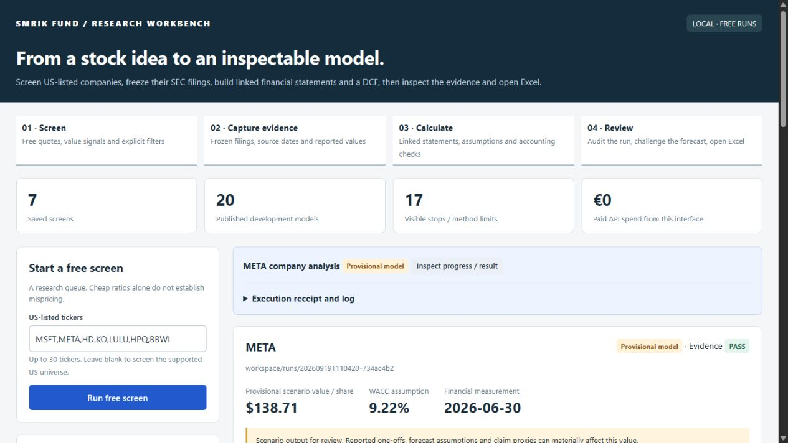

# smrik-fund

Personal financial-research tool: free US screening → explained shortlist →
frozen SEC filings → provisional three-statement DCF → formatted, editable Excel.
Paid LLM analysis is separate and explicit. No trading connection.

## Set up

Python 3.13+, Node.js 22+, and `uv` are required. Native workbook formatting and
verification additionally require Windows PowerShell and desktop Microsoft Excel.

```powershell
uv sync --frozen
npm ci --prefix scripts/spreadsheet_compat
$env:SMRIK_EDGAR_USER_AGENT = "Your Name your-email@example.com"
```

Use your own SEC identity. Keep credentials in your environment or local `.env`;
never commit them. Screening and free DCF work do not need an OpenAI key.

## Use

Start the local website:

```powershell
uv run smrik-fund daily serve --port 8787
```

Open [the research workbench](http://127.0.0.1:8787). Launch a free screen,
select a company, then inspect the run's evidence, assumptions, checks and Excel.
Each attempt gets a new folder; failures retain their stage and reason.
The website cannot make paid LLM calls.

See [the workbench guide and code walkthrough](docs/WORKBENCH.md).
The same workflow is available through the CLI:



```powershell
uv run smrik-fund daily run --tickers MSFT,LULU,HPQ,BBWI
# Or screen the supported US universe:
uv run smrik-fund daily run --shortlist 20
```

Open `data/daily/<run>/index.html`. To model a company from that run:

```powershell
uv run smrik-fund daily deep data/daily/<run> LULU --output-dir data/daily/lulu-research
```

`daily deep` makes no paid LLM calls. Assumptions remain provisional, reported
history is preserved, and unsupported methods or unresolved facts block a model.
Bank/insurer/REIT cases require dedicated methods. Successful accounting checks
do not establish an investment thesis or universal coverage.

See [daily commands and methodology](docs/DAILY_RESEARCH.md),
[verified status](docs/V1_STATUS.md), and
[architecture and acceptance criteria](docs/AI_FUND_BUILD_GUIDE.md).
Generated filings, workbooks and model responses remain local under `data/`.

## Validate

Reproducible tests requiring no downloaded financial data or paid calls:

```powershell
uv run pytest -q tests/test_analysis_budget.py tests/test_company_case.py tests/test_daily_research.py tests/test_research_workspace.py
```

Other integration tests use frozen local cases under `data/`, Node and sometimes
native Excel. They are not a clean-clone test suite. Missing research artifacts
are distinct from provider or accounting failures. The status document records
the real-case checks performed and known limits.

