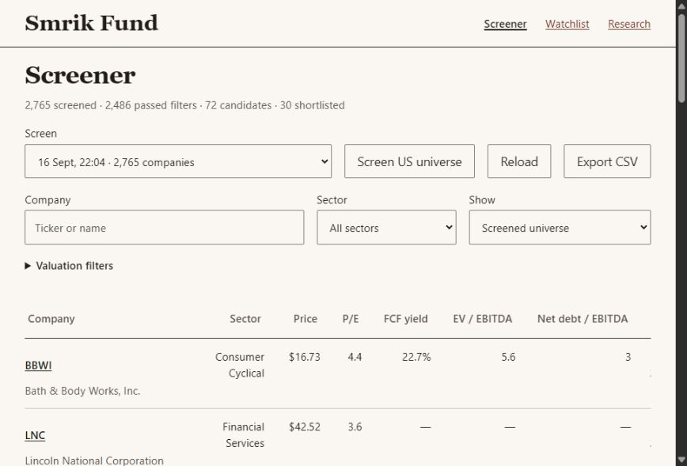

# Local research workbench

The workbench turns the free research pipeline into a usable daily desk:
screen companies, choose one, run its model, inspect the evidence, open Excel.
It reads real saved runs; its dashboard is not sample data. Financial assumptions
remain provisional. Passing accounting checks is not investment approval.

## Start

After the [README setup](../README.md):

```powershell
uv run smrik-fund daily serve --port 8787
```

Open [Screener](http://127.0.0.1:8787/screener) to browse companies or
[Research](http://127.0.0.1:8787/) to inspect runs. Keep the server terminal running. Closing the browser
does not cancel a submitted job; reopening the page restores its receipt.
If the port is occupied, use another `--port`. The server binds to loopback only.
This is a local application, not an internet deployment or multiuser service.

1. **Run screen.** Enter up to 30 US-listed tickers, or leave blank for the
   supported US universe. Small watchlists may lack enough sector peers to
   produce a shortlist. Cached vendor observations retain their original dates.
2. **Run analysis.** Choose a saved screen and company. Its quote must be
   USD and no more than seven days old. The workflow freezes SEC filings, tries
   the supported statement model, calculates a DCF and verifies native Excel.
3. **Inspect.** Completion status and evidence integrity are separate. Read the
   assumptions, source classifications, input-level evidence and limitations.
   Expand the timeline for timestamps and the exact stage of a stop.
4. **Open Excel.** Download the published workbook. Keep the original unchanged
   for auditing; edit a separate copy. To rerun an explicit scenario, paste a
   complete `operator-assumptions.json` into the optional assumptions field.

Each run receives a new directory under `data/workspace/runs/`. Jobs and logs
live under `data/workspace/jobs/`. Prior runs are never overwritten. Only one UI
job runs at a time; do not concurrently launch other native Excel runs by CLI.

No workbench action can invoke a paid agent. Free scenarios use recorded defaults
and the selected quote as the share-price input in WACC capital weights. Other
forecast and discount-rate inputs remain estimates. Paid CLI analysis remains a
separate explicit action outside this interface.

## Screener and watchlist

[Screener](http://127.0.0.1:8787/screener) opens the latest saved broad universe,
even when a newer small ticker screen exists. Choose **Show** to view the full
screen, companies passing the initial filters, candidates with fresh inputs or
the saved shortlist. Search by ticker/name, filter by sector, or expand
**Valuation filters** for P/E, FCF yield and net debt/EBITDA. A numeric filter
excludes missing values; missing values remain blank in exports and dashes on
screen. Click a column to sort; the table shows 25 companies per page.

The September 16 capture contains **2,765 companies, 2,486 passing initial
filters, 72 candidates and 30 shortlisted**. This is the provider's US-region
universe across eleven sectors, after size, price and liquidity filters, not
every US listing or universal SEC/model coverage. The saved initial thresholds
are market cap >= USD1bn, price >= USD3 and average volume >=100,000 shares.
Read **Metrics & sources** for the selected screen's scope and source links.

Quotes and ratios are saved observations, not live prices. Their original dates
remain visible. **Candidates · fresh** requires a saved candidate decision,
a quote no more than seven days old and a financial period no more than 200
days old. The original shortlist remains available after its inputs become
stale. **Screen US universe** starts a new free screen; **Reload** rereads local
results. Cached inputs keep their observation dates.

Click a ticker to inspect metrics, source dates, screening signals and open
questions. **Prepare analysis** selects that company and screen in Research;
**Open latest research** opens its latest saved attempt, including a stopped
attempt. The research page verifies its evidence before displaying the model.

[Watchlist](http://127.0.0.1:8787/watchlist) starts empty. Save up to 30 active
companies with a thesis, risks, next step, research stage and optional USD review
price. Archive retains notes and frees an active slot; select Archived to restore
an entry. Notes persist in `data/workspace/watchlist.json`, separately from
financial evidence. Conflicting edits from another tab are rejected and the
form is kept; **Load saved version** explicitly replaces it with the stored edit.

A review price is your threshold for revisiting a company, not a model value or
buy recommendation. **vs review = observed price / review price - 1**. A flag
appears only for a positive USD quote within seven days, at or below your
threshold. Missing, stale, future-dated or non-USD quotes cannot trigger it.
The watchlist uses the newest quote from a verified saved screen; rejected
sources and any fallback appear under data issues. Unknown tickers keep notes
without invented financial values. **Screen watchlist** refreshes active entries
through the existing free pipeline.

**Export CSV** includes all filtered rows, not just the current page, with quote
currency/time, financial period, source screen, original/current candidate
status, signals and watchlist notes. Ratio percentages are fractions in CSV
(e.g. 0.10 means 10%); strings beginning with spreadsheet formula characters
are escaped. No paid calls or background schedules are introduced.



## Read the result correctly

| Display | Meaning |
| --- | --- |
| Screen complete | Deterministic screening completed; cheap ratios are research signals. |
| Provisional | Supported model built; no independent paid analytical review was run. |
| Specialist method | SEC evidence saved; a bank, insurer or REIT needs another method. |
| Stopped | Read the recorded stage/reason. Partial evidence remains available. |
| Evidence PASS | The listed bindings/checks passed; this does not approve assumptions. |
| Evidence FAIL | An artifact changed, required evidence is missing, or a check failed. |

The audit recomputes screen decisions from the frozen vendor snapshot. Company
audits check source-file hashes, source/model bindings, published model/snapshot/
workbook hashes, accounting gates and the Excel receipt. New runs also bind the
Excel receipt's hash; historical receipts without that binding show a warning.
Hashes detect accidental changes relative to the saved manifests; they are not
digital signatures or proof against someone rewriting every artifact.

The audit displays saved checks. It does not silently re-fetch prices, rerun
Excel, rerun the historical code revision or replace financial judgment.
An unpublished candidate can have intact source evidence while its overall run
remains stopped. Its candidate workbook is not offered as a published result.

## Current coverage: September 19, 2026

The additional ten-company test produced:

| Ticker(s) | Result | Concrete limitation or evidence |
| --- | --- | --- |
| META, HD, KO | Full free DCF and native Excel | 572 cells checked per workbook; beta edit/restoration passed. |
| JPM, O | Sources only | Financial institution / REIT specialist methods required. |
| MSFT | Stopped | Generic assembler cannot isolate pure D&A from the combined source caption. |
| JNJ, XOM | Stopped | No supported operating-income source subtotal. |
| PG | Stopped | Combined cash lacks the required restricted-cash reconciliation. |
| CAT | Stopped | Common-equity classification remains unsupported. |

The separate existing MSFT pipeline and prior LULU, HPQ, BBWI, AAPL, AMZN, COST
cases are not evidence of universal generic coverage. The current test adds
real cases and explicit failure receipts; it does not establish a population
coverage percentage. [Detailed coverage receipt](COVERAGE_20260919.md).

## Interface

The page uses a compact editorial layout: controls and run history beside the
selected result, with assumptions, checks and source records in expandable
sections. On phones the result comes first; **New run** jumps to the controls.
Click a filing form (10-K or 10-Q) to open its SEC record. Its accession is also
available on the link. **Run record** shows the path and any available job
timestamps and execution log. Colors, typography and spacing are in the root `tokens.css`; no external
fonts or frontend framework are required.

Project-local skills: [no-ai-slop](../.agents/skills/no-ai-slop/SKILL.md), installed
from [petergyang/no-ai-slop](https://github.com/petergyang/no-ai-slop), and
[anti-slop-design](../.agents/skills/anti-slop-design/SKILL.md), copied verbatim
from the supplied text. The latter's three linked reference files were not
supplied; its main instructions are installed. Both are available to Codex on
the next turn. The existing Hallmark skill guided the editorial treatment.

## Code walkthrough

The existing financial calculations remain the same path for CLI and UI:

```text
workbench.html → research_workspace.py → daily_cli.py
                                          ↓
                            research_workflow.run_deep
                                          ↓
                      company_case → company_run → Excel

research_audit.py ← frozen artifacts from each stage
```

| File | Responsibility / where to begin |
| --- | --- |
| `tokens.css` | Shared colors, font stacks and spacing. Served only at `/tokens.css`. |
| `src/smrik_fund/watchlist.html` | Screener/watchlist tables, filters, CSV export and company editor. Uses the same local CSS tokens and free job API. |
| `src/smrik_fund/research_watchlist.py` | `screener` verifies a saved universe; `watchlist` joins notes to verified observations; `save_entry` validates an atomic, revision-checked edit. |
| `src/smrik_fund/workbench.html` | Page, forms and rendering. `refresh` lists runs; `inspect` shows evidence; `start` submits a free job. |
| `src/smrik_fund/research_workspace.py` | Small standard-library HTTP server. `job_arguments` permits only two free commands. `start_job` saves a receipt and launches Python without a shell; `execute_job` records completion. |
| `src/smrik_fund/daily_cli.py` | Thin Typer commands. `daily serve`, `daily audit` and `daily deep` expose the same functions to a terminal. |
| `src/smrik_fund/research_workflow.py` | `run_deep`: verify selection → freeze sources → route method → run model. Every stage is timestamped; failures are preserved. |
| `src/smrik_fund/research_audit.py` | Read-only indexing and evidence checks. `verify_screen` also guards deep-run selection. |
| `src/smrik_fund/portable_model.py` | Source assembly: reported fields, units, periods, explicit derived groups and unresolved source ambiguities. |
| `src/smrik_fund/company_run.py` | Formula build, optional explicit paid analysis, native Excel verification and publication hashes. UI always calls it with `live=False`. |

No database or new web framework is required. Run folders are the storage format.
The browser cannot supply executable commands or arbitrary file paths. Downloads
are confined to recognized research artifacts inside `data/`; host/origin and
session-token checks protect local job submission. Hard worker exits become
failed receipts rather than leaving normal running jobs permanently active.

## Verify from a terminal

```powershell
uv run smrik-fund daily audit data/coverage/20260919/KO/run-r2
uv run pytest -q tests/test_analysis_budget.py tests/test_company_case.py tests/test_daily_research.py tests/test_research_workspace.py tests/test_research_watchlist.py
```

The contract suite runs without paid calls. Two optional KO/HD financial tests
skip when their frozen local SEC cases are absent. Broader integration tests use
locally downloaded cases and the Node spreadsheet runtime. A full historical
suite is not currently clean; see [status](V1_STATUS.md).

## Financial workbook

See [history and statement layout](FINANCIAL_HISTORY.md) for the five-year history, TTM comparison, local formulas and source audit.
